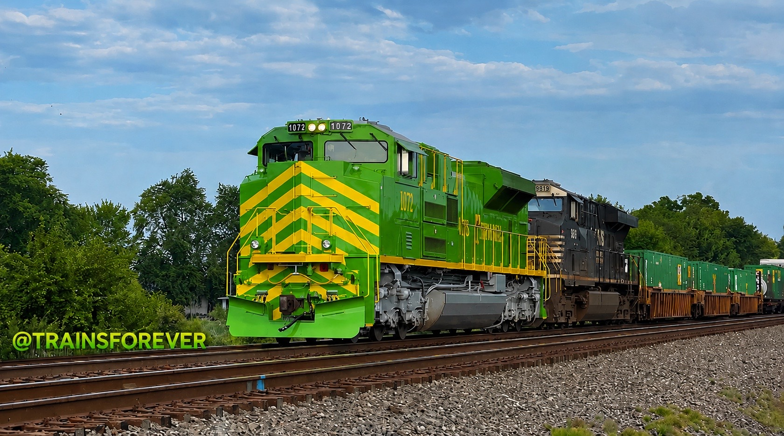

## ❤️ Curator's Favorite

NS 1072 – Illinois Terminal has always been my favorite Norfolk Southern Heritage Unit.

Every Heritage Unit is an important piece of railroad history, and each one has its own unique story. The Illinois Terminal has always stood out to me. The fun memories documenting it, like racing it with my cars or chasing it with my bikes with Alex. This  locomotive has become the Heritage Unit I look forward to seeing the most.

This exhibit includes a few extra photographs, memories, and personal highlights to the railfanning journey. While every exhibit in the TrainsForever Archive Museum is equally important, this one is my personal favorite.

## Museum Record:
12 documented catches 

📸 Documented Catches:
12

🚂 Leading Catches:
6

🚋 Trailing Catches:
2

🎥 Documented Videos:
8

📷 Documented Photographs:
Updating...

📍 Last Documented Catch:

Late August, 2025

## 🏛️ Museum Status

**Exhibit Status:** 🟢 Complete

**Photographed:** ✅

**Video Recorded:** ✅

**Caught Leading:** ✅

🤝 Railfan Companions:

💙 Alex
💜 Connor
❤️ Grey

## ⭐ Personal Highlights

🚂 Favorite Norfolk Southern Heritage Unit

📸 Favorite Photograph: 

🎥 Favorite Video: [Illinois Terminal chase](https://youtu.be/ATHFicFQbu0?is=)

📍 Favorite Catch Location: Goshen Indiana

## Story of our bike chases

Getting a selfie from the bikes with alex chasing 1072 one handed was a crazy experience. it's not the only heritage we've chased on the bikes! We chased 8102 (Pennsylvania) from Elkhart to Chesterton. 1072 (Illinois Terminal) from Elkhart to Milford. We chased a new CPKC from Elkhart to Mishawaka on the bikes as well. Many more! 

## 🚂 Locomotive Information

**Heritage Unit:** NS 1072

**Original Railroad:** Illinois Terminal Railroad

**Years in Operation:** 1896–1982

**Locomotive Model:** EMD SD70ACe

**Builder:** Electro-Motive Diesel (EMD)

**Horsepower:** 4,300 HP

**Heritage Paint Unveiled:** 2012

**Current Status:** Active

◀️ [Back to Norfolk Southern Collection](norfolk-southern-heritage.md)
