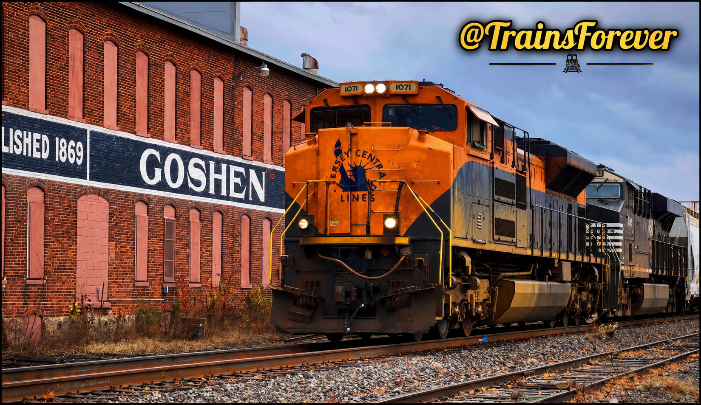

🚂 NS 1071 – Central Railroad of New Jersey

Welcome to the Central Railroad of New Jersey Heritage Exhibit.

Norfolk Southern Heritage Unit NS 1071 honors the legacy of the Central Railroad of New Jersey (CNJ), a railroad that served the northeastern United States for more than a century. This exhibit preserves my personal history with NS 1071, documenting every catch, photograph, video, and milestone as part of the TrainsForever Archive Museum. 

⸻

📸 Museum Record

Documented Catches: 6

⸻

🎯 Museum Status

🟢 Complete

✅ Photographed

✅ Video Recorded

✅ Leading Catch Documented

⸻

📊 Museum Statistics

📸 Documented Catches: 6

🚂 Leading Catches: 3

🚃 Trailing Catches: 2

🎥 Archived Videos: 5

📷 Archived Photographs: Updating…

📍 Documented Locations: Nappanee, Elkhart, Osceola, Goshen, (Indiana)

🤝 Railfan Companions: 1

⸻

🤝 Railfan Companions

💙 Alex

⸻

📅 Latest Documented Catch

November, 2024
NS 1071 was spotted leading it's train on the NS marian Branch in late October or Nevomber 1st, 2024. I have not spotted 1071 since. 

The most recent documented catch of NS 1071 will be added as the exhibit continues to grow.

⸻

🎥 Featured YouTube Video

🎬 **Watch on YouTube:** [The Jersey Central](https://youtu.be/LBq0vBA3G-8?is=...)

This featured video documents one of my encounters with NS 1071 – Central Railroad of New Jersey and has been selected for preservation in the TrainsForever Archive Museum as a representative recording of this heritage unit. Leading it's train through Goshen Indiana, on the NS Marian Branch to Elkhart Yard. 

⸻

📸 Featured Photograph

Featured Photograph — NS 1071 – Central Railroad of New Jersey. This image has been selected for preservation in the TrainsForever Archive Museum as a representative photograph of the CNJ Heritage Unit. Photograph by TrainsForever.

⸻

📝 Curator’s Notes

NS 1071 – Central Railroad of New Jersey is one of Norfolk Southern’s original Heritage Units, honoring the historic CNJ. This exhibit preserves my documented encounters with the locomotive through photographs, videos, and personal records.

As new photographs, videos, and documented catches are recorded, this exhibit will continue to grow as part of the TrainsForever Archive Museum.

Every documented catch helps preserve the history of this heritage unit for future railfans to enjoy.

⸻

[⬅️ Back to Norfolk Southern Heritage Collection](norfolk-southern-heritage.md)
